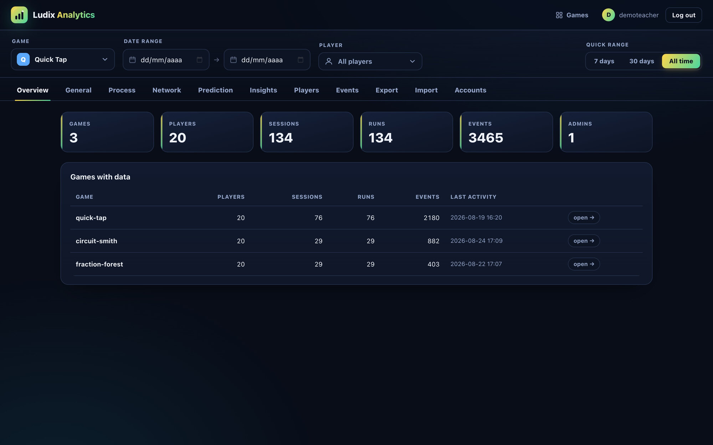
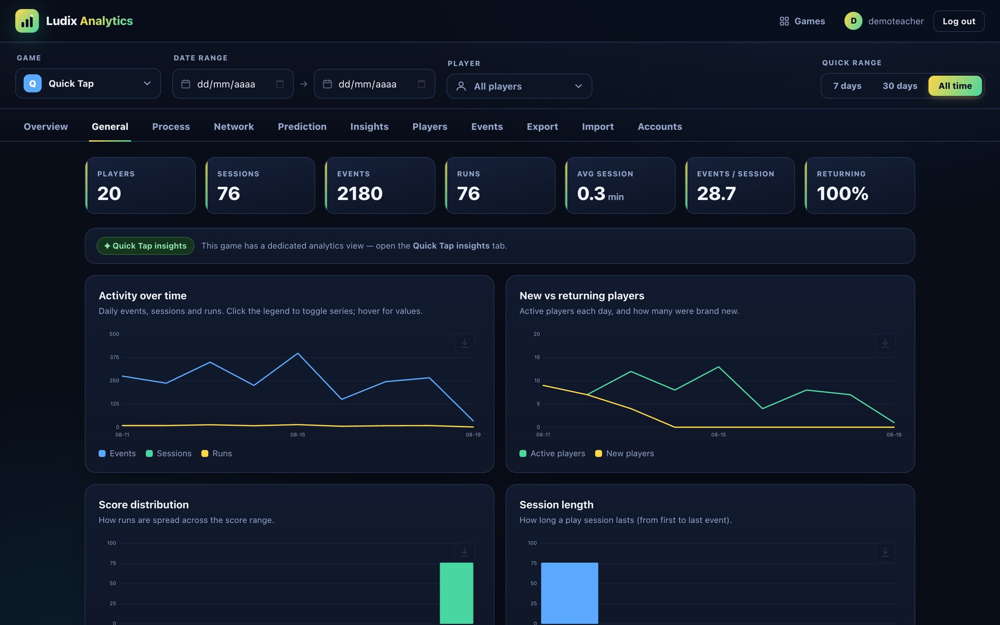
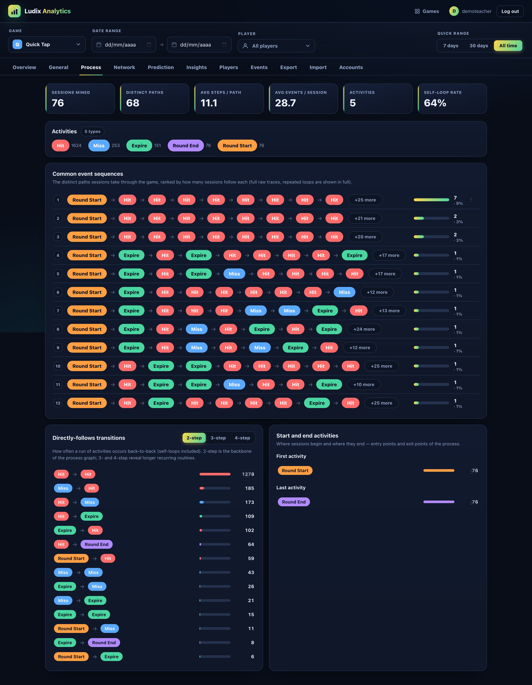
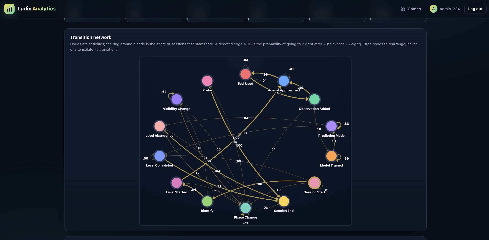
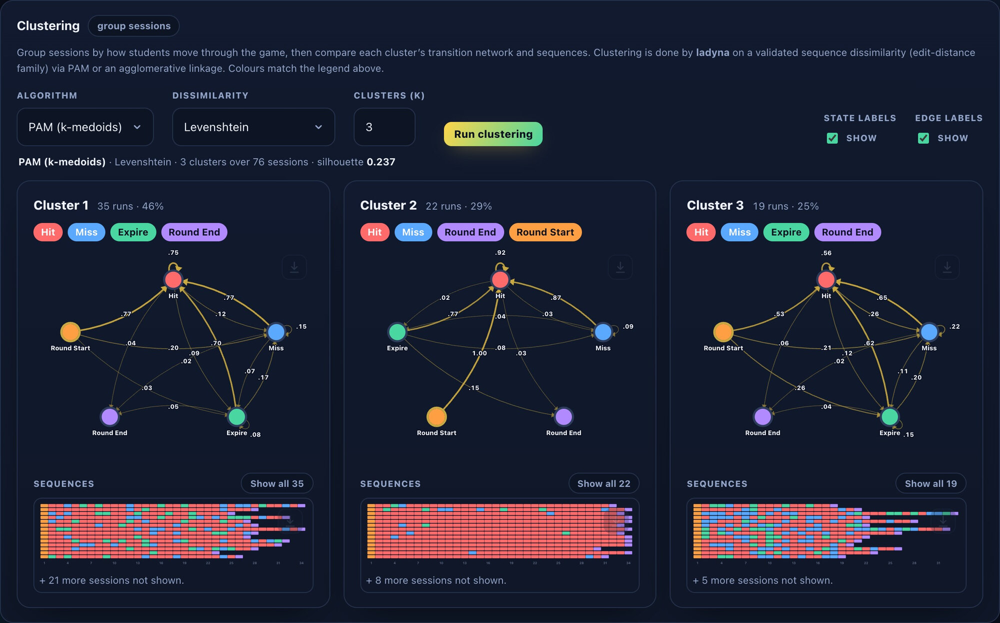
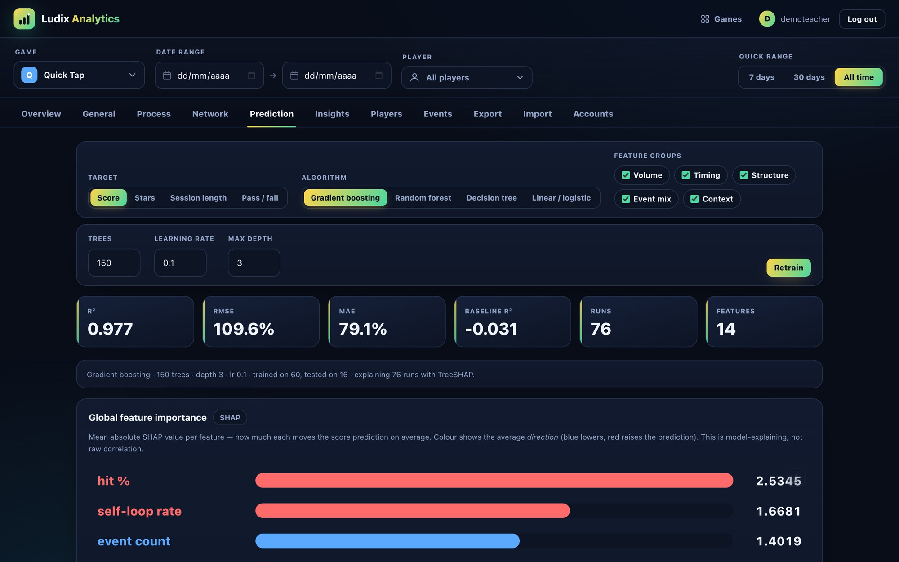
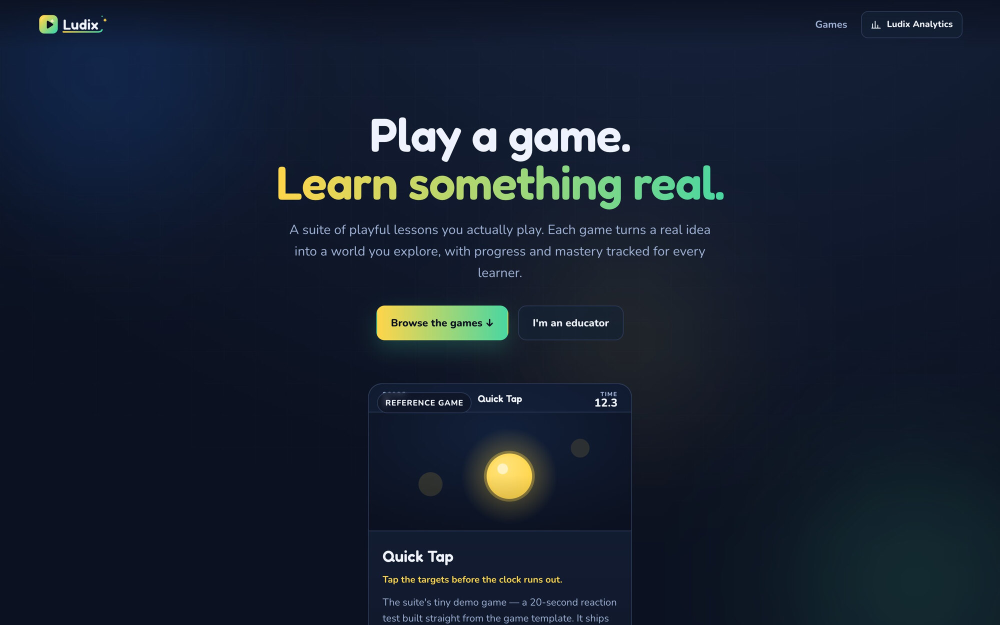

<div align="center">

<picture>
  <source media="(prefers-color-scheme: dark)" srcset="server/public/brand/logo-dark-tagline.svg">
  <source media="(prefers-color-scheme: light)" srcset="server/public/brand/logo-light-tagline.svg">
  
</picture>

### A game-agnostic backend and learning-analytics dashboard for serious games

<p>
  
  
  
  
  
</p>

<sub><b>Keywords</b> · learning analytics · serious games · process mining · transition network analysis · sequence clustering · explainable AI (SHAP) · educational data mining</sub>

</div>

---

**Ludix** is a platform for building serious games and analysing how they are played, all in one place, from the games themselves to reproducible learning analytics over the play they generate. It hosts a suite of
games, records how each one is played, and turns that activity into learning analytics that researchers can reproduce and report.

What makes it more than a descriptive dashboard is that it is also **inferential**. Alongside the
usual engagement metrics, Ludix brings together advanced methods that normally live in separate research
tools, including process mining, transition-network analysis, behaviour-based clustering, and
explainable prediction, and it backs its findings with real statistics: bootstrapped confidence on
network edges, permutation tests between groups, and effect estimates corrected for multiple
comparisons. The point is to tell a genuine pattern from noise, not just to draw a nice chart.

All of this works from one simple idea of an event: a record of who did what, and when. Because every
analysis reads that shared format, the same methods apply to any game with no extra code, and to
event logs imported from other systems. Ludix can serve as a ready-to-run suite of games with
analytics attached, or as a stand-alone workbench for serious-game data you already have.

<div align="center">

<br><em>One dashboard for a whole suite of games. Every view is scoped by game, date range, and cohort, and computed from a single generic event log.</em>
</div>

## Why Ludix (motivation & significance)

Serious-games research routinely collects rich interaction telemetry, yet that data usually stays
siloed inside a single game and is analysed ad hoc. Reproducing a study, or reusing a method across
games, means re-implementing the analytics each time. Ludix addresses this with three design
commitments aimed squarely at the research community:

- **Game-agnostic by construction.** All analytics read a generic event envelope, so a method
  validated on one game transfers unchanged to the next, and to logs that were never produced by
  Ludix (see [Bring your own data](#bring-your-own-data)).
- **Method provenance and rigor, not black boxes.** The heavy statistics are delegated to validated
  implementations rather than re-derived: transition-network analysis, centralities, bootstrap edge
  validation and dissimilarity clustering come from **[ladyna](https://github.com/mohsaqr/tna-js)**,
  a machine-precision-validated JavaScript port of the R [`tna`](https://cran.r-project.org/package=tna)
  package [[1]](#references) [[2]](#references); feature attribution uses **exact path-dependent
  TreeSHAP** [[3]](#references) [[4]](#references). Randomised
  procedures (bootstrap, clustering, train/test splits) share one seeded generator, so results are
  reproducible.
- **Publication-ready outputs.** Every chart, network and plot is hand-drawn inline SVG and can be
  exported as **SVG or PNG** (with light/dark/transparent backgrounds and a chosen resolution) for
  direct inclusion in papers and slides.

| For researchers | For educators & practitioners | For game developers |
|:--|:--|:--|
| A reproducible, game-agnostic analytics pipeline (process mining, TNA, clustering, XAI) over a standard event model, exportable for publication | A single dashboard to see how students actually play (engagement, learning curves, common paths, cohorts) with no data-science setup | A template that ships already wired into identity, scoring, and the full analytics stack; instrument a game with three calls |

## The analytics

Every game streams play events to the backend; analyses are computed once and apply to any game.
Views can be scoped by **game**, **date range**, and one or more **students/cohorts**.

### Engagement & learning-analytics metrics

Beyond activity counts, the **General** tab reports research-oriented indicators derived from the
generic log: a **learning curve** (mean score by attempt number), an **effort/performance**
correlation (session length / event volume vs. outcome, with Pearson *r*), a **player-retention
survival curve**, and an **engagement-inequality** view (Lorenz curve + Gini) quantifying how
concentrated participation is across learners.

<div align="center">

<br><em>Engagement at a glance: KPIs, activity over time, new-vs-returning players, and score/session distributions. The tab continues with a research-analytics block (learning curve, effort/performance correlation, retention survival, and Lorenz/Gini engagement inequality).</em>
</div>

### Process mining

The **Process** tab reconstructs how sessions move through a game: per-activity statistics, the
**directly-follows graph**, **start/end** activities, and **trace variants**, the distinct raw
paths learners take, ranked by frequency and coverage. Variants are standard raw traces (repeated
loops are shown in full, not collapsed), and longer *n*-step routines are surfaced as 3- and 4-step
directly-follows chains. Process discovery is delegated to ladyna’s `processmining` module.

<div align="center">

<br><em>Process statistics, the activity mix, and the most common event sequences (each row expandable); the directly-follows graph and start/end activities follow below.</em>
</div>

### Transition network analysis (TNA)

Each game is modelled as a first-order **Markov transition network**: activities are nodes and a
directed edge A→B carries the transition probability *P(B | A)*. The view derives **initial-state
probabilities**, the full R-`tna` set of **node/edge centralities** (out/in-strength, betweenness,
closeness, PageRank, …), a **sequence index plot**, **state cliques**, and optional **bootstrap edge
validation** (which transitions are statistically stable rather than noise). TNA is a recent
learning-analytics method [[1]](#references); Ludix makes it available game-agnostically and
interactively.

<div align="center">

<br><em>A game’s transition network: node size scales with frequency, the ring encodes start probability, and edge width scales with transition probability.</em>
</div>

### Behaviour-based sequence clustering

Sessions are grouped by **how** learners move through a game, then each cluster’s transition network
and sequence-index plot are compared side by side. Clustering runs on a **validated sequence
dissimilarity** (Levenshtein / edit-distance family, Euclidean, Manhattan, cosine, or
Jensen–Shannon) with **PAM (k-medoids)**, agglomerative linkage, or k-means, and reports a
**silhouette** score for the partition, turning “types of players” into a defensible, quantified
split.

<div align="center">

<br><em>k-medoids on Levenshtein distance splits sessions into behaviour groups; each cluster gets its own transition network and sequence-index plot, with a silhouette score for the split.</em>
</div>

### Explainable predictive modelling (SHAP)

The **Prediction** tab estimates a run-level outcome (score, stars, session length, or pass/fail)
from behaviour features folded from that run’s event stream, then **explains** the model. Estimators
are dependency-free implementations (**gradient-boosted trees**, random forest, a single decision
tree, and linear/logistic regression), and explanations use **exact path-dependent TreeSHAP** for
both **global** feature importance and **per-run local** attributions (a waterfall from the model’s
baseline to its prediction). Held-out diagnostics (R²/RMSE/MAE vs. a naïve baseline, predicted-vs-
actual) keep the model honest. This brings interpretable machine learning to game telemetry without
a Python/R stack.

<div align="center">

<br><em>An interpretable model of run outcome: choose target, estimator and feature groups, read held-out metrics (R²/RMSE/MAE vs. a baseline), and inspect global SHAP feature importance; the tab continues with a SHAP beeswarm, per-run local explanations (waterfall), and predicted-vs-actual diagnostics.</em>
</div>

### Statistical pattern→outcome mining and cohort comparison

The Network tab also mines **frequent behavioural patterns** and screens each for association with a
run outcome: the change in Score/Stars when a pattern is present (OLS), or its log-odds for Pass
(logistic), with **Benjamini–Hochberg** adjustment for multiple testing. A **cohort comparison**
splits sessions on a median outcome and contrasts the two transition networks edge-by-edge with a
**permutation test**, flagging transitions that genuinely differ between higher- and lower-performing
learners.

## Bring your own data

Because the analytics read a generic event log, they run on **any** log, not only data collected
through Ludix. The dashboard’s **Import** tab takes a CSV or JSON log, auto-detects the
case / activity / timestamp / actor columns (the standard process-mining quadruple), and imports it
under a game name, where every view above applies. A file exported from the **Export** tab
re-imports exactly, so datasets and figures are shareable and reproducible.

## Methods & reproducibility

All methods used are validated against rigorous statistical frameworks to guarantee reliable, reproducible outcomes:

- **We don't reinvent the statistics.** The transition networks, centralities, edge validation and
  sequence clustering are computed by [ladyna](https://github.com/mohsaqr/tna-js) [[2]](#references),
  a JavaScript port of the R [`tna`](https://cran.r-project.org/package=tna) package
  [[1]](#references) that is checked against the original to machine precision; the process maps come
  from the same library.
- **The model explanations are exact, not approximate.** Feature importance uses **SHAP / TreeSHAP**
  [[3]](#references) [[4]](#references), which traces each prediction back to the inputs that produced
  it.
- **Re-running gives the same answer.** Anything with a random step in it (the bootstrap, the
  clustering, the train/test split) is driven by a fixed seed, so the same data and the same
  settings reproduce the same figures.
- **Everything rests on one simple event shape.** An event is just *who* did *what*, *when*, in
  *which* session (the same shape process-mining tools expect [[8]](#references)), which is exactly
  why the analyses move freely between games and accept data from outside Ludix.
- **The methods are standard ones, not homemade.** Under the hood: directly-follows process
  discovery and trace variants [[8]](#references); first-order Markov transition networks
  [[1]](#references); the usual network centralities; k-medoids / hierarchical / k-means clustering
  [[6]](#references) over sequence distances, checked with a silhouette score [[5]](#references);
  gradient-boosted trees read through SHAP [[3]](#references) [[4]](#references); plain OLS / logistic
  effect estimates with a Benjamini–Hochberg correction when many patterns are tested at once
  [[7]](#references); and a permutation test for comparing two networks.

## Design

- **One server for every game.** A single small Node/Express/SQLite backend runs the whole suite. There is one database file, created automatically the first time you start it, with nothing to migrate or set up.
- **The analytics don't care which game sent the data.** Games just report runs and events tagged with a game id; engagement, process mining, network analysis, clustering and prediction all work off that shared stream, so adding a game adds no analytics code.
- **The dashboard has no build step.** Its charts, networks and SHAP plots are drawn as plain inline SVG (no bundler, no CDN, no front-end framework), which keeps it easy to read, host, and check for yourself.
- **Adding a game means copying the template.** The copy already knows how to sign a player in, record scores, feed the leaderboard, and stream analytics; anything you build with an `index.html` shows up on the landing page.
- **No passwords for learners.** A student picks a unique name once and gets a private token that lets only them submit under it, which is simple enough for a classroom, with no accounts to manage.

<div align="center">

<br><em>The learner-facing landing page lists every installed game; the bundled <b>Quick Tap</b> reference game is built from the template.</em>
</div>

## Quick start

```bash
npm run install:server   # install the server's dependencies (once)
npm run build            # bundle every game into dist/
npm start                # run the suite (builds missing games on first boot)
```

Then open:

- http://localhost:3000/ (the player landing page, a card per game)
- http://localhost:3000/quick-tap/ (Quick Tap, the bundled reference game)
- http://localhost:3000/admin (the educator dashboard)

The dashboard needs an admin account, and a seeded demo makes every analysis explorable immediately:

```bash
cd server && npm run admin -- add teacher "a-good-password"
npm run seed:demo        # sample players, runs and events across three games, so
                         # engagement, process mining, TNA, clustering and prediction all work off it
```

Everything else is configured in `server/.env` (copy `server/.env.example`). See
[`server/`](server/) for the full server and API documentation.

## Add a game

Copy the template, a complete game already wired into identity, scoring, analytics, and the
leaderboard:

```bash
cp -R games/_template games/space-quiz   # the slug becomes the URL and gameId
npm run build                            # picked up automatically → dist/space-quiz/
npm start                                # live at /space-quiz/
```

Then replace `games/space-quiz/js/game.js` with your game. The three `Suite.*` calls that connect it
to the backend (claim identity, submit a run, log analytics events) are documented in
[`games/_template/README.md`](games/_template/README.md). An optional landing card and a
game-specific **Insights** view are wired via
[`server/src/landing.js`](server/src/landing.js) (`GAME_META`) and
[`server/src/games-analytics/`](server/src/games-analytics/).

> Folders starting with `_` or `.` (such as `games/_template/`) are ignored by the build and the
> server, so the template never ships as a game.

## Repository layout

```
.
├── server/            # the backend: one Node/Express/SQLite server for the whole suite
│   ├── src/           #   score + analytics API; process-mining, TNA, clustering & prediction engines
│   └── public/admin/  #   the no-build dashboard UI (inline-SVG charts, networks, SHAP)
├── games/             # game source, one folder per game (develop here)
│   ├── _template/     #   copy-me starter (ignored by the build; never ships)
│   └── quick-tap/     #   Quick Tap: the reference game (built from the template)
├── dist/              # build output: self-contained bundles the server hosts (git-ignored)
├── docs/img/          # screenshots used in this README
└── scripts/build-all.js   # builds every game in games/* into dist/*
```

Source (`games/`) is built into served bundles (`dist/`). Each `dist/` subfolder with an
`index.html` appears on the landing page and is served at `/<slug>/`.

## Documentation

- Server and API: [`server/README.md`](server/README.md) (endpoints, config, deploy)
- Quick Tap, the reference game: [`games/quick-tap/README.md`](games/quick-tap/README.md)
- Adding a game: [`games/_template/README.md`](games/_template/README.md)

## References

The methods and libraries Ludix builds on:

1. **`tna`, Transition Network Analysis** (R package). Saqr, M., López-Pernas, S., et al. CRAN: <https://cran.r-project.org/package=tna>
2. **ladyna / `tna-js`**, a JavaScript port of `tna` used by Ludix. <https://github.com/mohsaqr/tna-js>
3. Lundberg, S. M., & Lee, S.-I. (2017). *A Unified Approach to Interpreting Model Predictions.* NeurIPS. arXiv:[1705.07874](https://arxiv.org/abs/1705.07874)
4. Lundberg, S. M., et al. (2020). *From local explanations to global understanding with explainable AI for trees* (TreeSHAP). *Nature Machine Intelligence*, 2, 56–67.
5. Rousseeuw, P. J. (1987). *Silhouettes: a graphical aid to the interpretation and validation of cluster analysis.* *Journal of Computational and Applied Mathematics*, 20, 53–65.
6. Kaufman, L., & Rousseeuw, P. J. (1990). *Finding Groups in Data: An Introduction to Cluster Analysis* (PAM / k-medoids). Wiley.
7. Benjamini, Y., & Hochberg, Y. (1995). *Controlling the False Discovery Rate.* *Journal of the Royal Statistical Society: Series B*, 57(1), 289–300.
8. van der Aalst, W. M. P. (2016). *Process Mining: Data Science in Action.* Springer.

Runtime dependencies: [Node.js](https://nodejs.org), [Express](https://expressjs.com), and [`better-sqlite3`](https://github.com/WiseLibs/better-sqlite3).

## Contributing

Contributions are welcome. The most direct way in is to add a game with the template above, or to
improve the shared server and analytics. Open an
[issue](https://github.com/mjgm97/ludix/issues) or a pull request.

## License and citation

Ludix is released under the [MIT License](LICENSE). If you use it in academic work, please cite it
using the metadata in [`CITATION.cff`](CITATION.cff), from which GitHub renders a “Cite this
repository” button.